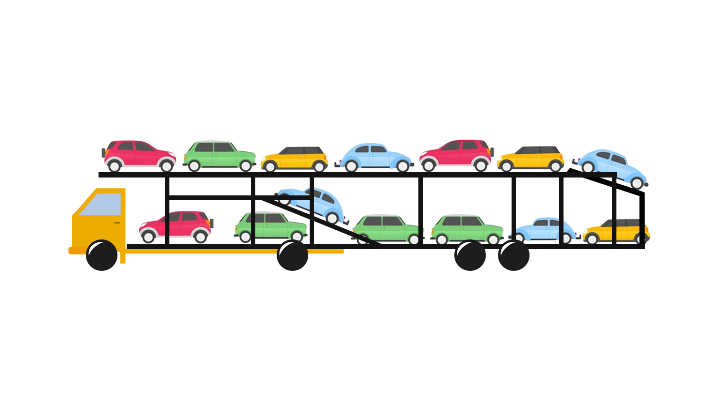

### Caminhões do sistema - dia 03/06/2019

```html
<!-- Utilizando PNG: -->



```
```html
<!-- Utilizando JPEG: -->


```
#### Utilizando url:

```html
<!-- Caminhão:-->
</img>
```

```html
<!-- Caminhão Trator e semi-reboque (Prancha):  -->
</img>
```

```html
<!-- Caminhão e semi-reboque (Romeu e Julieta): -->
</img>
```

```html
<!-- Caminhão e semi-reboque: -->
</img>
```

#### Em Breve

  ```html
<!--   Utilizando SVG: -->
  
  
  
  
```
